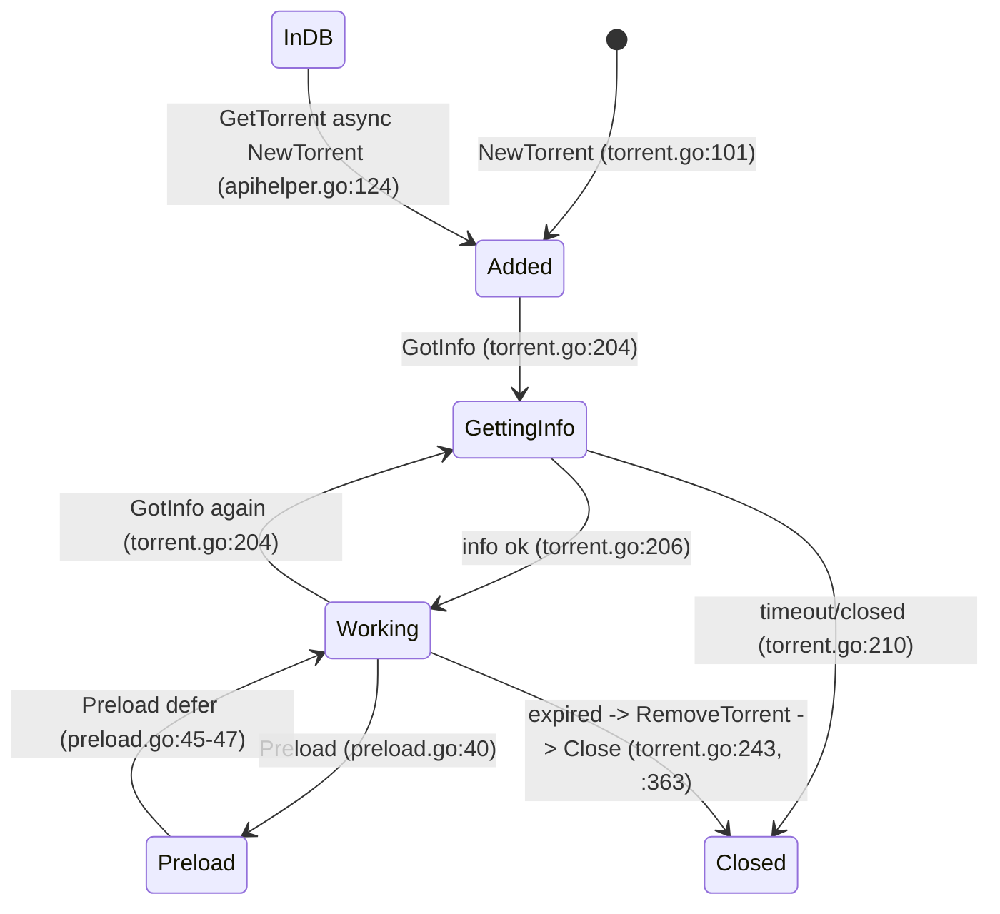

# Torrent lifecycle

**App:** server
**Status:** stable
**Last reviewed:** 2026-09-14 (commit `215f6fca` + staged pin Phases 1–5)

## Summary
`torr.Torrent` wraps an anacrolix `*torrent.Torrent` plus TorrServer metadata and the per-torrent `torrstor.Cache`. It is registered in `BTServer.torrents` on creation, polled every second by a `watch` goroutine, and unloaded (dropped from the client and the map) when idle past its expiry time. Unloaded torrents persisted in DB are represented by DB-only copies with `Stat=TorrentInDB`. Unfinished DB torrents pinned `all`/`next` are loaded again after `Connect` and every minute by the resume loop, which also re-applies loaded pins ([Torrent pin](torrent-pin.md)).

## Entry points
- `server/torr/torrent.go:64` — `NewTorrent`: called by `AddTorrent`, `LoadTorrent`, `GetTorrent` (see [Torrent API helpers](torrent-api-helpers.md))
- `server/torr/torrent.go:191` — `GotInfo`: called by HTTP handlers before use (`server/web/api/torrents.go:143`, `server/web/api/stream.go:146`, `server/web/api/play.go:64`, `server/torr/stream.go:48`) and by `GetTorrent`'s async load (`server/torr/apihelper.go:133`)
- `server/torr/torrent.go:236` — `progressEvent`: 1 s tick, records pin downloaded ids, owns timeout unload
- `server/torr/btserver.go:62` — `Connect`: called at startup (`server/web/server.go:59`, then `torr.StartResumePinned()` `:64`) and by `SetSettings`/`SetDefSettings` (`server/torr/apihelper.go:353`, `:372`, each followed by `resumePinned()`)

## Key files
| File | Role |
|---|---|
| `server/torr/torrent.go` | `Torrent` struct, info wait, pin apply, expiry, close, `Status()` |
| `server/torr/btserver.go` | `BTServer`: anacrolix client, `torrstor.Storage`, `torrents` map under `mu` |
| `server/torr/resume.go` | Resume loop for pinned torrents — see [Torrent pin](torrent-pin.md) |
| `server/torr/pin.go` | Pin set, targets, downloaded ids, no-space set — see [Torrent pin](torrent-pin.md) |
| `server/torr/state/state.go` | `TorrentStat` enum + status JSON ([Torrent status JSON](../../concepts/torrent-status-json.md)) |
| `server/torr/storage/torrstor/storage.go` | Per-hash `Cache` map; `GetCache` used after info (`server/torr/storage/torrstor/storage.go:81`) |
| `server/torr/utils/torrent.go` | Default/file trackers merged in `NewTorrent` (`GetDefTrackers` `:77`, `GetTrackerFromFile` `:58`) |
| `server/torr/utils/freemem.go` | `FreeOSMemGC` (GC + `debug.FreeOSMemory`) called on `Disconnect` (`server/torr/btserver.go:82`) |
| `server/torr/btserver_race_test.go` | `TestBTServerTorrentsConcurrentAccess` (`:12`) |
| `server/torr/torrent_test.go` | `TestExpired` (`:82`), pin apply tests; window/anchor/downloaded/pause tests in `server/torr/pin_test.go` — see [Torrent pin](torrent-pin.md) |

## Torrent struct (`server/torr/torrent.go:23-62`)
- Metadata: `Title`, `Category`, `Poster`, `Data` (`:24-27`), embedded `*torrent.TorrentSpec` (`:28`), `Timestamp`, `Size` (`:31-32`).
- Pin mirror: `PinMode`, `PinNext`, `PinAnchor`, `PinDownloaded` (`:34-37`), guarded by `muTorrent`; DB row is the owner — see [Torrent pin](torrent-pin.md).
- `Stat state.TorrentStat` (`:30`).
- Embedded `*torrent.Torrent` (`:39`) — nil for DB copies and after `drop()`.
- `muTorrent sync.Mutex` (`:40`).
- `bt *BTServer`, `cache *torrstor.Cache` (`:42-43`) — both nil for DB copies (`server/torr/dbwrapper.go:63-76`).
- Speed accounting: `lastTimeSpeed`, `DownloadSpeed`, `UploadSpeed`, `BytesReadUsefulData`, `BytesWrittenData` (`:45-49`).
- Preload: `PreloadSize`, `PreloadedBytes` (`:51-52`); ffprobe: `DurationSeconds`, `BitRate` (`:54-55`).
- `expiredTime` (`:57`), `closed <-chan struct{}` = `goTorrent.Closed()` (`:59`, `:104`), `progressTicker` (`:61`).

## States (`server/torr/state/state.go:24-31`)
`TorrentAdded=0`, `TorrentGettingInfo=1`, `TorrentPreload=2`, `TorrentWorking=3`, `TorrentClosed=4`, `TorrentInDB=5`. Strings at `server/torr/state/state.go:5-22`.

## Flow
1. **Create** `NewTorrent` (`server/torr/torrent.go:64`):
   - Fails if `bt.client == nil` (`:66-68`).
   - Rewrites `spec.Trackers` per `BTsets.RetrackersMode` 1 append / 2 clear / 3 replace (`:69-76`); appends `trackers.txt` entries (`:78-81`).
   - `bt.client.AddTorrentSpec(spec)` (`:83`) — before the map check.
   - Under `bt.mu`: if hash already in `bt.torrents`, returns the existing `*Torrent` (`:88-92`).
   - Initial expiry = `TorrentDisconnectTimeout` capped at 1 min (`:94-97`, `:106`); `Stat=TorrentAdded` (`:101`); `Timestamp=now` (`:107`); starts `watch` (`:109`); stores in map (`:111`).
2. **Info** `WaitInfo` (`:115`): waits `GotInfo()` channel, `closed`, or timer `1 min + TorrentDisconnectTimeout` (`:121`). On info, sets `t.cache = bt.storage.GetCache(hash)` and `cache.SetTorrent` (`:125-127`), then `applyPin()` (`:128`): under `muTorrent`, mode `all`/`next` + `UseDisk` + info → `pinPieces(layout from sortedFiles, mode, N, anchor)`, free-space check of `TorrentsSavePath` (`freeSpace` < missing wanted bytes + 1 GiB → paused, empty want set, no-space entry), `cache.SetPin` (`:140-189`); mode off / `!UseDisk` → clear no-space entry + `SetPin(nil, nil)`; no info → `SetPin(nil, nil)` — see [Torrent pin](torrent-pin.md). Cache itself is created by anacrolix calling `Storage.OpenTorrent` (`server/torr/storage/torrstor/storage.go:27-39`).
   `GotInfo` (`:191`): false if nil/Closed (`:193-195`); true without waiting if `Preload` (`:198-200`); reads `TorrentDisconnectTimeout` into a local **before** waiting (`:203`); sets `GettingInfo` (`:204`); on success `Working` + extend expiry by that uncapped timeout (`:205-208`); on failure `Close()` (`:210`).
3. **Watch** (`:222-234`): 1 s ticker; each tick spawns `go t.progressEvent()` (`:229`); exits on `closed` (`:230-231`).
4. **progressEvent** (`:236-271`):
   - First `t.updatePinDownloaded()` (`:238`): pinned + `UseDisk` + `!ReadOnly` + info → ids of fully complete files; on change mirror + DB row (`server/torr/pin.go:306-350`). Runs **before** `expired()`, so the last completion is persisted before a timeout unload.
   - If `expired()` → log `Torrent close by timeout` + `t.bt.RemoveTorrent(hash)` and return (`:239-245`).
   - Under `muTorrent`: speeds from `Torrent.Stats()` deltas (`:247-259`); `PreloadedBytes = cache.GetState().Filled` (`:260-262`).
   - `updateRA()` (`:270`): fixed 16 MB readahead pushed to all cache readers (`:287-288`, `server/torr/storage/torrstor/cache.go:304-314`).
5. **expired()** (`:291-300`): `false` if `cache == nil` (`:292-294`); `false` while `cache.PinPending()` (a wanted pin piece incomplete, `:295-298`; a paused pin has no wanted piece); else `cache.Readers() == 0 && expiredTime < now && (Stat == Working || Stat == Closed)` (`:299`).
   - `Readers()` = count of registered `torrstor` readers (`server/torr/storage/torrstor/cache.go:520-527`), added in `Torrent.NewReader` (`:327-333`), removed in `CloseReader` which also extends expiry by `TorrentDisconnectTimeout` (`:335-338`).
   - Expiry extended by `AddExpiredTime` (`:215-220`, only moves forward) from `NewTorrent`, `GotInfo`, `CloseReader`, `GetTorrent` (`server/torr/apihelper.go:115`), preload log loop (`server/torr/preload.go:100`). `resumePinned` never calls `GetTorrent` for a loaded torrent (it only re-runs `applyPin`), so it does not extend expiry.
6. **Close** (`:353-375`): nil → false; already Closed → true (`:357-359`); `settings.ReadOnly` with in-use readers → false (`:360-362`); sets `Stat=Closed` (`:363`); deletes from `bt.torrents` under `bt.mu` (`:365-371`); `drop()` (`:373`).
7. **drop** (`:344-351`): under `muTorrent`, `Torrent.Drop()` and `t.Torrent = nil`. `Torrent.Drop()` closes the storage synchronously → `Cache.Close` (proven by `closeWithPieceFiles`, `server/torr/storage/torrstor/cache_test.go:751`), so `Cache.Close` runs while `drop()` holds `muTorrent`.
8. **Status()** (`:377-502`), under `muTorrent`:
   - Always: metadata, `Stat`, `StatString`, `TorrentSize=t.Size`, `BitRate`, `DurationSeconds` (`:383-392`), `PinMode`, `PinNext` (`:393-394`); `Hash` from spec (`:398-401`).
   - If `t.Torrent != nil`: name, hash, `LoadedSize = Torrent.BytesCompleted()` (`:406`), preload/speeds (`:408-411`), anacrolix stats (`:413-429`).
   - If info: `TorrentSize = Torrent.Length()` (`:432`); `sortedFiles(t.Files())` — in-place sort by `utils2.CompareStrings(path_i, path_j)` (`server/torr/pin.go:195-200`, `server/utils/strings.go:83`), shared with `applyPin`; `Id = i + 1` in that order (`:434-445`); pinned mirror → per-file `pinned`/`completed`/`downloaded` + `pin_progress` (`:446-454`); `TorrsHash` token (`:456-472`).
   - `t.Torrent == nil` and pinned: stub `file_stats`/`pin_progress` from `Data` file list + row `PinDownloaded` (`:474-495`).
   - Pinned, progress < 100, hash in no-space set, `UseDisk` → `pin_error:"no_space"` (`:496-499`). Unpinned: no pin fields, JSON unchanged. Field semantics: [Torrent status JSON](../../concepts/torrent-status-json.md).
9. **CacheState()** (`:504-511`): `cache.GetState()` + `Status()`; nil when unloaded.

## BTServer (`server/torr/btserver.go`)
- Fields: `client`, `storage *torrstor.Storage`, `torrents map[metainfo.Hash]*Torrent`, `mu sync.RWMutex` (`:24-33`).
- `Connect` (`:62-74`): `PrefetchTrackers`; under `mu`: `configure`, new client, **new empty `torrents` map** (`:70`), `InitApiHelper(bt)` (`:71`).
- `configure`: `bt.storage = torrstor.NewStorage(BTsets.CacheSize)` and sets it as `DefaultStorage` (`:98-99`) — new storage per Connect.
- `Disconnect` (`:76-84`): `client.Close()`, `client=nil`, `FreeOSMemGC`; does not touch `torrents`.
- `GetTorrent` (`:262-267`) RLock lookup; `ListTorrents` (`:269-275`) copies the map; `RemoveTorrent` (`:277-283`) looks up then calls `Torrent.Close()` outside the lock (comment `:278`).

## Dependencies
- Overview: [server](_overview.md)
- Cache/readers/eviction: [Torrent storage cache](torrent-storage-cache.md)
- Callers: [Torrent API helpers](torrent-api-helpers.md), [Torrent pin](torrent-pin.md), [Streaming](streaming.md), [Preload](preload.md)
- Concepts: [Torrent status JSON](../../concepts/torrent-status-json.md)

## Gotchas / decisions
- **Only unload path by time:** `progressEvent` → `expired()` → `RemoveTorrent` (`server/torr/torrent.go:239-243`). A pin gates it via `cache.PinPending()` (`:296`); a finished or paused pin (no wanted incomplete piece) falls back to the normal timeout. Without readers, expiry is refreshed only by `GetTorrent` (`server/torr/apihelper.go:115`), preload (`server/torr/preload.go:100`), `GotInfo` (`server/torr/torrent.go:207`) and `CloseReader` (`server/torr/torrent.go:337`).
- `expired()` needs `Stat` Working or Closed (`:299`). A torrent left in `TorrentAdded` never times out — e.g. `LoadTorrent` uses `WaitInfo`, not `GotInfo` (`server/torr/apihelper.go:33`). `Preload` state also never expires.
- `expired()` is false while `cache == nil` (`:292-294`); cache is only assigned in `WaitInfo` (`:125-127`). `PinPending` is checked before the `Readers`/time/`Stat` test, so an unfinished pin also keeps a `TorrentAdded`/`Preload` torrent loaded (they never expire anyway).
- **`updatePinDownloaded` runs before `expired()`** in `progressEvent` (`:237-239`): the downloaded ids must be written before the tick that unloads the torrent (mutation M10, `TestProgressEventRecordsDownloadedBeforeExpiry`). Live smoke: `Pin downloaded files: … [1 2 3 4]` and `Torrent close by timeout` in the same second.
- Preload readers are plain anacrolix readers, not counted by `cache.Readers()` (`server/torr/preload.go:134`, `:186`).
- Other unload paths: `RemTorrent`/`DropTorrent` (`server/torr/apihelper.go:294`, `:337`); `SetSettings`/`SetDefSettings` → `dropAllTorrent` calls `drop()` (not `Close`, so `Stat` stays and the map entry stays) then `Disconnect`+`Connect` which replaces the map (`server/torr/apihelper.go:378-383`, `server/torr/btserver.go:70`). Afterwards `resumePinned()` loads unfinished DB torrents pinned `all`/`next` again (`server/torr/apihelper.go:354`, `:373`); unpinned torrents are not reloaded. At startup the resume loop starts right after `BTS.Connect()` (`server/web/server.go:64`) and is stopped before `BTS.Disconnect()` in `web.Stop` (`:168-169`).
- **Stale map entries are load-bearing:** after `drop()` (settings reload) or `client.Close` (`Disconnect`) the closed `*Torrent` stays in `bt.torrents` until the next `Connect`. `removeTorrentDirAfterClose` therefore treats "loaded again" as a *different* `*Torrent` under the hash (`server/torr/apihelper.go:258-262`), not a non-nil lookup — see [Torrent pin](torrent-pin.md).
- `GotInfo` failure calls `Close()` (`:210`) — a slow-to-resolve magnet is unloaded after `1 min + TorrentDisconnectTimeout`.
- **`GotInfo` reads the timeout before `WaitInfo`** (`:201-203`): the pin apply inside `WaitInfo` is the last synchronised step of an async load, so tests can restore `settings.BTsets` race-free. The expiry extension uses the value from the start of the info wait.
- `GotInfo` on a Working torrent flips `Stat` to `GettingInfo` briefly and re-reads cache and re-applies the pin (no cache effect when unchanged, but the free-space check runs) (`:204-206`, `:125-128`).
- Expiry timeout inconsistency: capped at 1 min in `NewTorrent`/`GetTorrent` (`:94-97`, `server/torr/apihelper.go:110-112`), uncapped in `GotInfo`/`CloseReader` (`:203`, `:337`).
- `BTsets` read live (no snapshot) in `NewTorrent` (`:69`, `:94`), `WaitInfo` (`:121`), `applyPin` (`UseDisk` `:146`, `TorrentsSavePath` `:172`), `GotInfo` (`:203`), `CloseReader` (`:337`), `updatePinDownloaded` and `Status()` pin error (`UseDisk`); storage capacity read only at `Connect` (`server/torr/btserver.go:98`).
- Locks: `bt.mu` guards the map; `Torrent.Close` takes `bt.mu` so callers must not hold it (`server/torr/btserver.go:278`). `muTorrent` guards `drop`, `Status`, speed stats, the pin mirror (incl. anchor `server/torr/pin.go:214-220` and downloaded ids `pin.go:310-328`), and preload `Stat` transitions (`server/torr/preload.go:34-41`). `Stat` writes in `GotInfo`/`Close` and the read in `expired()` are unlocked (`:204-206`, `:363`, `:299`). `applyPin` holds `muTorrent` while it calls `freeSpace` (`statfs`) and `SetPin` takes `Cache.muRemove` (`:143-188`, `server/torr/storage/torrstor/cache.go:141-149`); `savePinAnchor`/`savePinDownloaded` write the DB outside `muTorrent` (`server/torr/pin.go:232-243`, `:338-349`): lock order `muTorrent` → `muRemove` → `muPrio`/anacrolix lock; the no-space set mutex is a leaf. `drop()` → `Cache.Close` adds `muTorrent` → anacrolix client lock → `settings.mu` (`IsTorrentPinned`).
- `watch` spawns a new `progressEvent` goroutine every tick without waiting for the previous one (`:229`).
- File ids are positions in the natural-sorted path list, recomputed on every `Status()` (`:434-445`), every `applyPin` (`:159`) and every `updatePinDownloaded` (`server/torr/pin.go:317`); the pin anchor and `PinDownloaded` are file ids too; `CompareStrings` compares the leading number after the common prefix, else lexicographic (`server/utils/strings.go:83-99`).
- Disk data dir is never deleted by `Close`/`drop` in `torr`; deletion is in `Cache.Close` only when `RemoveCacheOnDrop` and the DB row is not pinned (`server/torr/storage/torrstor/cache.go:268-283`), in `RemTorrent`, and in `SetTorrentPin(off)` of a previously pinned torrent (after close for a loaded torrent); piece files of watched episodes are removed by `Cache.dropPieces` — see [Torrent API helpers](torrent-api-helpers.md), [Torrent pin](torrent-pin.md).

## Open questions
- Whether anacrolix `Client.Close()` (via `Disconnect`) calls `Cache.Close` for each torrent (library is `github.com/tsynik/torrent v1.2.31` replace, `server/go.mod:6`, not in local module cache). `Torrent.Drop()` does (synchronously). `Storage.CloseHash` exists (`server/torr/storage/torrstor/storage.go:47`) but has no caller in `server/`.
- `Shutdown` never reconnects (`server/torr/apihelper.go:393`), so stale `bt.torrents` entries persist until exit.
